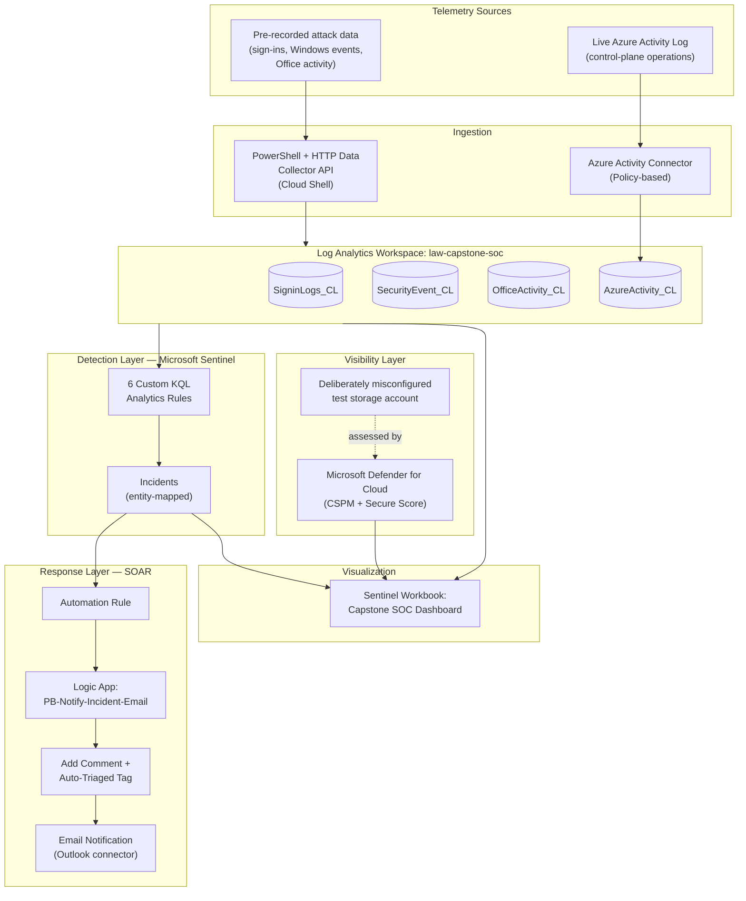

# Azure-Cloud-Security-Monitoring-Automated-Response-Platform
A hands-on capstone project that connects three things that are usually built separately: **cloud security posture visibility**, **SIEM-based threat detection**, and **automated incident response**. Built end-to-end on a personal Azure for Students subscription at essentially zero cost.

# Azure Cloud Security Monitoring & Automated Response Platform

A hands-on capstone project that connects three things that are usually built separately: **cloud security posture visibility**, **SIEM-based threat detection**, and **automated incident response**. Built end-to-end on a personal Azure for Students subscription at essentially zero cost.

**Author:** Sachin Thakur — MS in Cybersecurity, University of Denver

---

## Executive Summary

Most cloud security write-ups either talk about posture management, or SIEM detection, or SOAR automation — rarely all three connected in one pipeline. This project builds that pipeline:

- **Visibility:** Microsoft Defender for Cloud (CSPM) flags weak configuration before anything is attacked.
- **Detection:** Microsoft Sentinel runs six custom KQL analytics rules against real telemetry and turns matches into incidents.
- **Response:** An Azure Logic Apps playbook automatically triages every incident (comment + tag) and emails a structured alert — no human has to notice it first.

Everything below is what was actually built and tested, including the parts that didn't work on the first try. The repo also holds the KQL, the ingestion/simulation scripts, and the Logic App definition, so anyone can inspect or reproduce the pipeline.

**Full write-up:** [`docs/Capstone_Final_Report.pdf`](./docs/Capstone_Final_Report.pdf)
**Live demo walkthrough:** [`docs/Demo_Script.pdf`](./docs/Demo_Script.pdf)

---

## Architecture



**How data actually flows:** a telemetry source lands in a table inside the workspace → a scheduled analytics rule evaluates it → if the condition is met, Sentinel raises an incident with mapped entities → an automation rule fires the Logic App → the playbook comments on and tags the incident, then emails a notification → independently, the Workbook reflects the current state of everything for visualization.

---

## Ingestion Architecture

Two ingestion paths feed the workspace:

1. **Pre-recorded attack telemetry** — the one-click Sentinel Training Lab dataset I originally planned to use had been removed from the content hub during the build (confirmed against a public issue on the `Azure/Azure-Sentinel` GitHub repo). Instead, [`scripts/ingest-training-lab-data.ps1`](./scripts/ingest-training-lab-data.ps1) loads the same underlying records directly through the **Log Analytics HTTP Data Collector API**, signed with HMAC-SHA256, run from Azure Cloud Shell (which authenticates automatically and sidesteps identity issues covered below).
2. **Live Azure Activity logs** — an Azure Policy assignment streams the subscription's control-plane activity log into the workspace automatically. Two rules (resource deletion, privilege escalation) depend entirely on this connector.

Verified record counts after ingestion:

| Table | Records |
|---|---|
| `SecurityEvent_CL` (Windows security events) | 23,863 |
| `SigninLogs_CL` (sign-in logs) | 4 |
| `OfficeActivity_CL` (Office/Exchange activity) | 2 |
| `AzureActivity_CL` (Azure control-plane activity) | 23 |

**A schema detail that shaped every rule:** because the data was ingested as custom logs, Log Analytics appends type suffixes to column names, and some fields end up stored as a different type than you'd expect (one event-ID field is a *string*, not a number). Every KQL file in [`detections/`](./detections/) reflects the real, verified schema — not the schema you'd assume from documentation. This cost me a rule silently returning zero results once; see the report for the full story.

---

## MITRE ATT&CK Coverage Matrix

| Rule | Tactic | Technique | Technique Name |
|---|---|---|---|
| Rule 1 — Disabled-account sign-ins | Credential Access | T1110 | Brute Force |
| Rule 2 — Malicious inbox rule creation | Persistence / Defense Evasion | T1114, T1564.008 | Email Collection / Hide Artifacts |
| Rule 3 — Windows brute force | Credential Access | T1110 | Brute Force |
| Rule 4 — Sensitive resource deletion | Impact | T1485 | Data Destruction |
| Rule 5 — Impossible travel | Initial Access | T1078 | Valid Accounts |
| Rule 6 — Privilege escalation | Privilege Escalation | T1098 | Account Manipulation |

Coverage spans **5 distinct tactics** across **two data planes** (identity/endpoint and cloud control plane) — deliberately, so the suite isn't six variations on the same signal.

---

## Detection Rules Summary

| # | Rule | Data Source | Severity | File |
|---|---|---|---|---|
| 1 | Disabled-account sign-ins | `SigninLogs_CL` | Medium | [`rule1_disabled_account_signins.kql`](./detections/rule1_disabled_account_signins.kql) |
| 2 | Malicious inbox rule creation | `OfficeActivity_CL` | Medium | [`rule2_malicious_inbox_rule.kql`](./detections/rule2_malicious_inbox_rule.kql) |
| 3 | Windows brute force | `SecurityEvent_CL` | Medium | [`rule3_windows_brute_force.kql`](./detections/rule3_windows_brute_force.kql) |
| 4 | Sensitive Azure resource deletion | `AzureActivity_CL` | High | [`rule4_sensitive_resource_deletion.kql`](./detections/rule4_sensitive_resource_deletion.kql) |
| 5 | Impossible travel | `SigninLogs_CL` | High | [`rule5_impossible_travel.kql`](./detections/rule5_impossible_travel.kql) |
| 6 | Privilege escalation (role assignment) | `AzureActivity_CL` | High | [`rule6_privilege_escalation.kql`](./detections/rule6_privilege_escalation.kql) |

Rules 5 and 6 needed a constructed/supplemented test event to validate, because the small lab dataset didn't naturally contain that behavior — disclosed openly, not hidden. Full per-rule breakdown (test method, observed result, benign-positive discussion) is in the report.

---

## Automated Response (SOAR) Overview

The playbook is [`playbook/PB-Notify-Incident-Email.json`](./playbook/PB-Notify-Incident-Email.json), triggered by Sentinel's incident-creation trigger. It does three things in order:

1. **Adds a comment** to the incident recording that automated processing occurred.
2. **Applies an `Auto-Triaged` tag** to the incident.
3. **Sends a structured email** (via the Outlook connector's Send an email V2 action) with the incident's title, severity, status, description, and a direct link.

The two highest-confidence, High-severity rules (impossible travel, privilege escalation) are wired to trigger this full workflow automatically through a Sentinel automation rule.

**Important — what this is and isn't:** this is **automated notification and triage**, not **automated containment**. Nothing here disables an account, revokes a session, or blocks an IP. The incident is annotated and someone is told about it automatically — the underlying threat isn't stopped by the playbook itself. True containment is listed as future work; see the report for why (it needs Microsoft Graph directory-write permissions this subscription doesn't have, and the lab identities aren't real, disableable accounts).

---

## Simulation & Verification Guide

Use this to reproduce the environment and trigger every rule yourself.

### 1. Set up the base environment
- Create an Azure for Students subscription; confirm you hold the **Owner** role on the subscription.
- Create a resource group (`rg-capstone-soc`) and a Log Analytics workspace (`law-capstone-soc`) inside it.
- Enable Microsoft Sentinel on that workspace and connect it to the unified Defender portal.
- Enable the **Azure Activity connector** (via Azure Policy) so control-plane logs stream in.

### 2. Load attack telemetry
```powershell
# From Azure Cloud Shell
./scripts/ingest-training-lab-data.ps1 -WorkspaceId "<your-workspace-id>" -WorkspaceKey "<your-workspace-key>"
```
Verify ingestion with a quick count query in Sentinel Logs:
```kql
union SigninLogs_CL, SecurityEvent_CL, OfficeActivity_CL, AzureActivity_CL
| summarize count() by Type
```

### 3. Deploy the six detection rules
For each file in [`detections/`](./detections/):
1. Sentinel → **Configuration → Analytics → + Create → Scheduled query rule**.
2. Paste the KQL from the file.
3. Set severity and MITRE tactic exactly as noted in the file's header comment.
4. Map entities (Account / IP / Host) as noted in the file.
5. Set schedule: **daily**, not hourly — running frequently against static data is what caused the 900+ duplicate-incident problem documented in the report. Don't repeat that mistake.
6. Enable incident creation → Review + Create.

### 4. Trigger rules that need a constructed event
Two rules (impossible travel, privilege escalation) won't fire against the base dataset alone. Run:
```powershell
./scripts/inject-test-scenarios.ps1 -WorkspaceId "<your-workspace-id>" -WorkspaceKey "<your-workspace-key>" -Scenario ImpossibleTravel
./scripts/inject-test-scenarios.ps1 -WorkspaceId "<your-workspace-id>" -WorkspaceKey "<your-workspace-key>" -Scenario PrivilegeEscalation
```
Then re-run the corresponding rule manually (or wait for its next scheduled run) and confirm an incident appears in the Sentinel **Incidents** queue.

### 5. Deploy the response playbook
1. Import [`playbook/PB-Notify-Incident-Email.json`](./playbook/PB-Notify-Incident-Email.json) as a new Logic App in `rg-capstone-soc`.
2. Authorize the Outlook connector (sign in with the account that should send notifications).
3. In Sentinel, grant playbook permissions on `rg-capstone-soc` (**Automation → Playbook permissions**).
4. Create an automation rule on each analytics rule that should trigger it, pointing to this playbook.
5. Fire a test incident and confirm: comment added → tag applied → email received, in that order.

### 6. (Optional) Exercise the visibility layer
Deploy a test storage account with these settings turned **off/on** deliberately for a controlled CSPM demo:
- Secure transfer: **disabled**
- Anonymous blob access: **enabled**
- Shared key access: **enabled**
- Public network access: **all networks**

Wait for Defender for Cloud's next assessment cycle (can take several hours) and check the **Recommendations** page and Secure Score. Delete the account afterward — these settings are for testing only, never for anything real.

### 7. Build the dashboard
Create a Sentinel Workbook querying the workspace directly (not the other layers), with a total-incident counter, a top-rules bar chart, an incidents-over-time chart, and a failed-logons-over-time chart.

---

## Repository Structure
